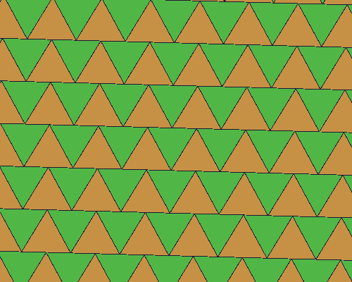
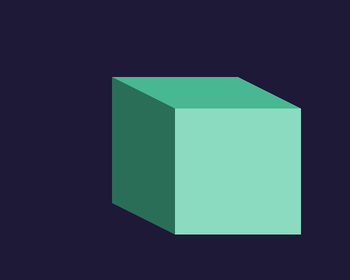
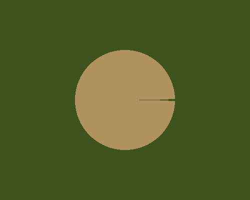

demöloops
=========

Toolkit for building looping gif "demos" and collection of such.

API undocumented until [schedulör](https://github.com/s-ol/schedulor) becomes stable.

zoom
----

neverending color-changing zoom-in on a circle that morphs into a rectangle

  
[(source)](zoom.moon)
[(on streak.club)](https://streak.club/p/17089/zooming-in-by-s-ol)

holosphere
----------

weird jumpy pseudo-3d sphere thing.
not that happy with it, either going to improve it until the end of the week or make a new one.

  
[(source)](holosphere.moon)
[(on streak.club)](https://streak.club/p/17097/holographic-sphere-gif-by-s-ol)

I made a second, different version reusing a lot of the code that I like better:

  
[(source)](holosphere2.moon)
[(on streak.club)](https://streak.club/p/17097/holographic-sphere-gif-by-s-ol)

triangles
---------

sort of inspired by one leafo made (["rects"](http://streak.club/p/5917/rects-by-leafo))

  
[(source)](triangles.moon)
[(on streak.club)](https://streak.club/p/17232/triangles-by-s-ol)

cube
----

not sure what exactly this is. sorry for missing last week :(

  
[(source)](cube.moon)
[(on streak.club)](https://streak.club/p/17372/cube-by-s-ol)

fracture
--------

a triangle splitting into 4 triangles and reassembling.

  
[(source)](fracture.moon)
[(on streak.club)](https://streak.club/p/17513/fractured-triangle-by-s-ol)

flipping
---------

more shapes. cut-short triangle flipping around a hexagon

  
[(source)](flipping.moon)
[(on streak.club)](https://streak.club/p/17646/flipping-by-s-ol)

circle
------

very simplistic one, needs improvement

  
[(source)](circle.moon)
[(on streak.club)](https://streak.club/p/17742/circle-by-s-ol)

twisted
-------

inspired by [this small tutorial](http://www.like100bears.com/writing/2d-3d-in-gamemaker-studio) on a 2d/3d artstyle

  
[(source)](twisted.moon)

shutter
-------

random shutter-y thing

  
[(source)](shutter.moon)

divide
------

accident from another WIP turned into this, might not continue original

  
[(source)](divide.moon)
