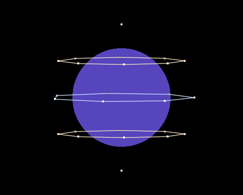
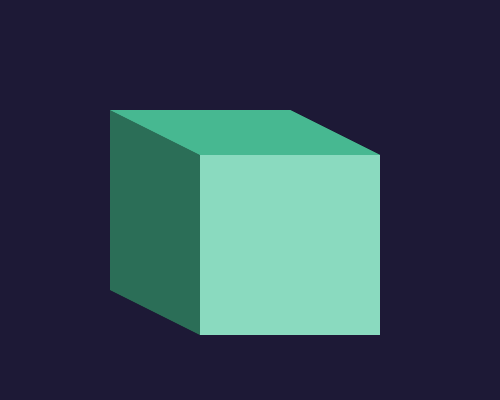
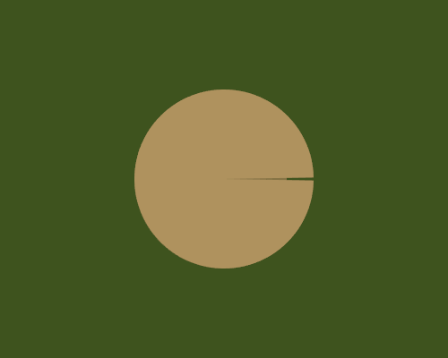
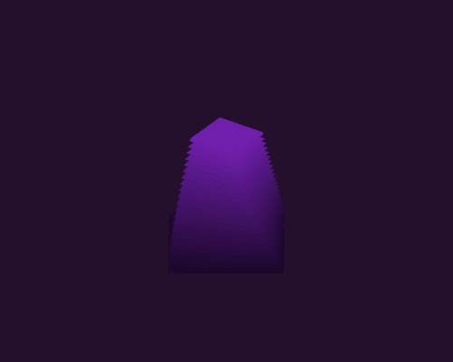
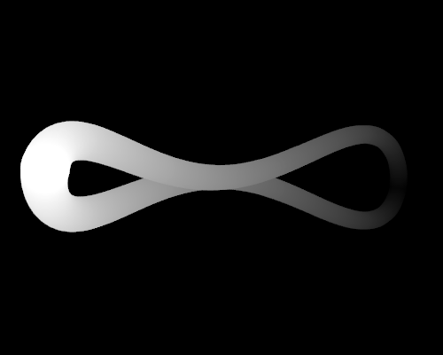

demöloops
=========

Toolkit for building looping gif "demos" and collection of such.

API undocumented until [schedulör](https://github.com/s-ol/schedulor) becomes stable.

zoom
----

neverending color-changing zoom-in on a circle that morphs into a rectangle

  
[(source)](zoom.moon)
[(on streak.club)](https://streak.club/p/17089/zooming-in-by-s-ol)

holosphere
----------

weird jumpy pseudo-3d sphere thing.
not that happy with it, either going to improve it until the end of the week or make a new one.

  
[(source)](holosphere.moon)
[(on streak.club)](https://streak.club/p/17097/holographic-sphere-gif-by-s-ol)

I made a second, different version reusing a lot of the code that I like better:

  
[(source)](holosphere2.moon)
[(on streak.club)](https://streak.club/p/17097/holographic-sphere-gif-by-s-ol)

triangles
---------

sort of inspired by one leafo made (["rects"](http://streak.club/p/5917/rects-by-leafo))

  
[(source)](triangles.moon)
[(on streak.club)](https://streak.club/p/17232/triangles-by-s-ol)

cube
----

not sure what exactly this is. sorry for missing last week :(

  
[(source)](cube.moon)
[(on streak.club)](https://streak.club/p/17372/cube-by-s-ol)

fracture
--------

a triangle splitting into 4 triangles and reassembling.

  
[(source)](fracture.moon)
[(on streak.club)](https://streak.club/p/17513/fractured-triangle-by-s-ol)

flipping
---------

more shapes. cut-short triangle flipping around a hexagon

  
[(source)](flipping.moon)
[(on streak.club)](https://streak.club/p/17646/flipping-by-s-ol)

circle
------

very simplistic one, needs improvement

  
[(source)](circle.moon)
[(on streak.club)](https://streak.club/p/17742/circle-by-s-ol)

twisted
-------

inspired by [this small tutorial](http://www.like100bears.com/writing/2d-3d-in-gamemaker-studio) on a 2d/3d artstyle

  
[(source)](twisted.moon)
[(source, lua)](twisted_lua.lua)

shutter
-------

random shutter-y thing

  
[(source)](shutter.moon)

divide
------

accident from another WIP turned into this, might not continue original

  
[(source)](divide.moon)

dots
----

inspired by [this reddit post](https://www.reddit.com/r/gifs/comments/5bayiu/dont_click_on_this_if_you_are_currently_drunk/)

  
[(source)](dots.moon)

weekly3
-------

invitation to [the 3rd 'weekly loop' online demoparty on streak.club](https://streak.club/s/818/weekly-loop-3)

  
[(source)](weekly3.moon)

planetary
---------

main idea has been done lots of times, but this was a nice exercise in geometry.

  
[(source)](planetary.moon)
[(on streak.club)](http://streak.club/p/25483/planetary-by-s-ol)

goldfish
--------

pssst, this is for my mom's birthday. don't tell her yet!

  
[(source)](goldfish.moon)
[(on streak.club)](https://streak.club/p/25634/goldfish-by-s-ol)

squaregrid
--------

two versions of monochrome grids of rotated squares / rounded squares.

  
[(source)](squaregrid.rotated.moon)

  
[(source)](squaregrid.rounded.moon)

  
[(source)](squaregrid.overlaid.moon)

[(on streak.club)](https://streak.club/p/25971/welp-by-s-ol)

toroid
------

tracing the two spirals around from 0 to 16 windings each. built at 34c3 with \[moritz\] as a stepping stone towards [torus3d](https://github.com/s-ol/torus3d).

  
[(source)](toroid.moon)

infinity
------

twisting and pulsing infinity-ish symbol.

  
[(source)](infinity.moon)
