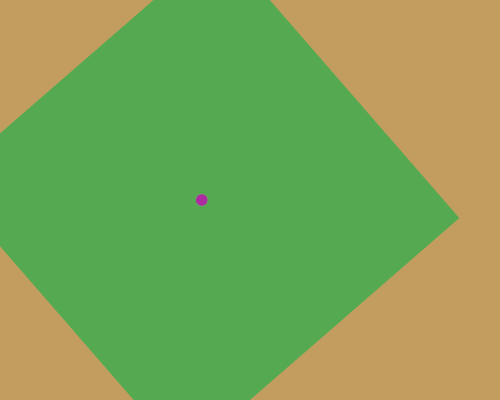
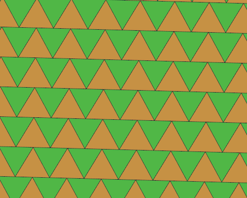

demöloops
=========

Toolkit for building looping gif "demos" and collection of such.

API undocumented until [schedulör](https://github.com/s-ol/schedulor) becomes stable.

zoom
----

neverending color-changing zoom-in on a circle that morphs into a rectangle

  
[(source)](zoom.moon)
[(on streak.club)](https://streak.club/p/17089/zooming-in-by-s-ol)

holosphere
----------

weird jumpy pseudo-3d sphere thing.
not that happy with it, either going to improve it until the end of the week or make a new one.

  
[(source)](holosphere.moon)
[(on streak.club)](https://streak.club/p/17097/holographics-sphere-gif-by-s-ol)

I made a second, different version reusing a lot of the code that I like better:

  
[(source)](holosphere2.moon)
[(on streak.club)](https://streak.club/p/17097/holographics-sphere-gif-by-s-ol)

triangles
---------

sort of inspired by one leafo made (["rects"](http://streak.club/p/5917/rects-by-leafo))

  
[(source)](triangles.moon)
[(on streak.club)](https://streak.club/p/17232/triangles-by-s-ol)

cube
----

not sure what exactly this is. sorry for missing last week :(

  
[(source)](cube.moon)
[(on streak.club)](https://streak.club/p/17372/cube-by-s-ol)
